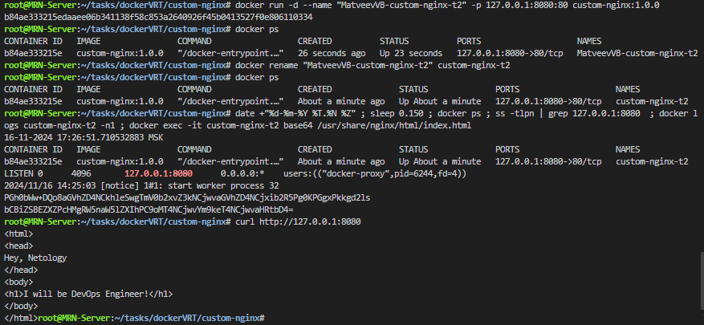
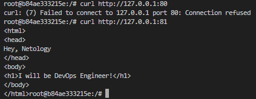
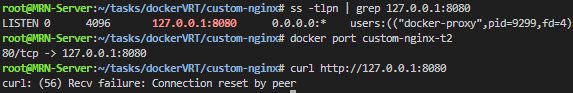
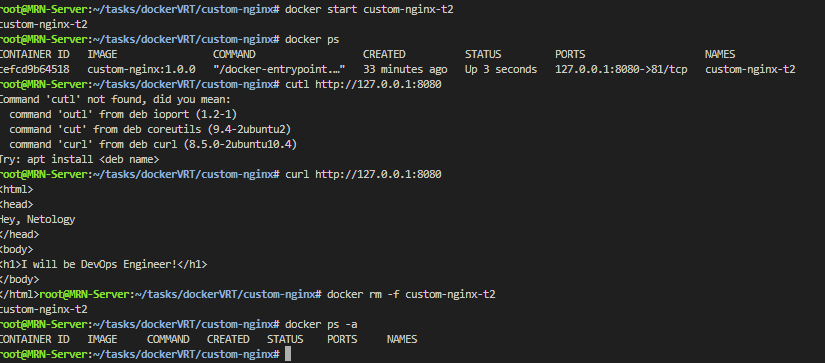
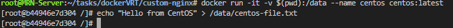
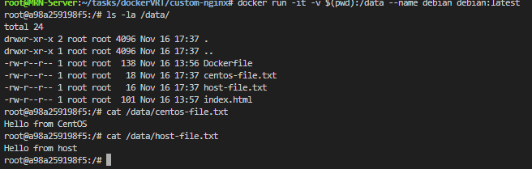
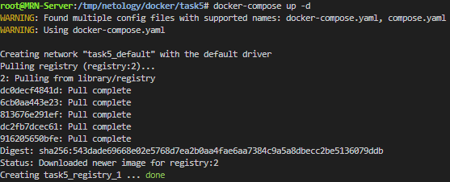
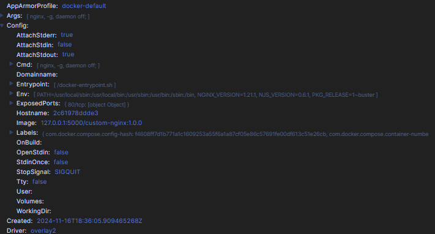
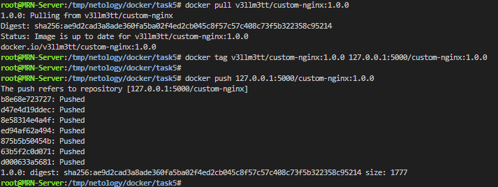

## Задача 1

### https://hub.docker.com/repository/docker/v3llm3tt/custom-nginx/general

---

## Задача 2

1. В качестве ответа приложите скриншоты консоли с командами и выводом.

---

## Задача 3

1. Исправли так Остановил контейнер, остановил докер. Ушел в /var/lib/docker/....hostconfig.json and config.v2.json. Изменил там порт 80 на 81, запустил докер запустил контейнер. и полетело

---

## Задача 4

---

## Задача 5

Кратко по заданию.

docker compose up -d  (если используется Docker Compose (до версии 2.0), предпочтение отдается файлу docker-compose.yaml)
Объедининл разворачивания 2 контейнеров в один - compose.yaml и удалил docker-compose.yaml
ИЗ предедущего взял заданяи взял custom-nginx затегировал и залил в локальную репу. и дальнешей в портайнере сделал по заданию 

